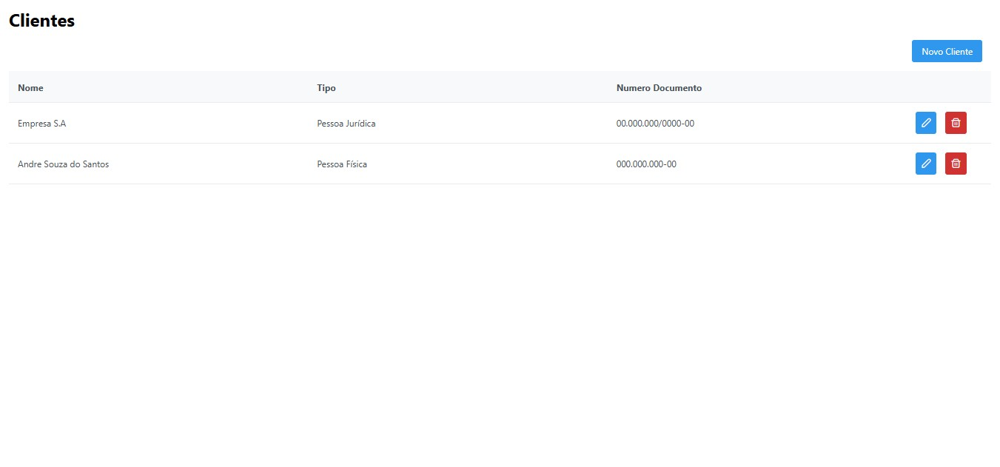
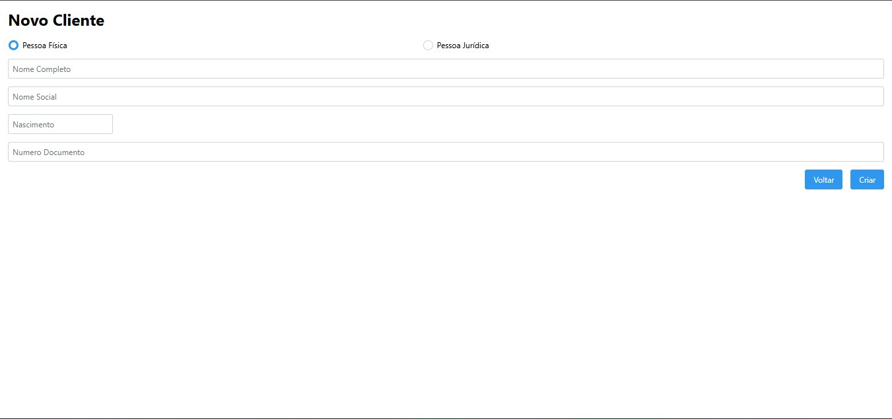
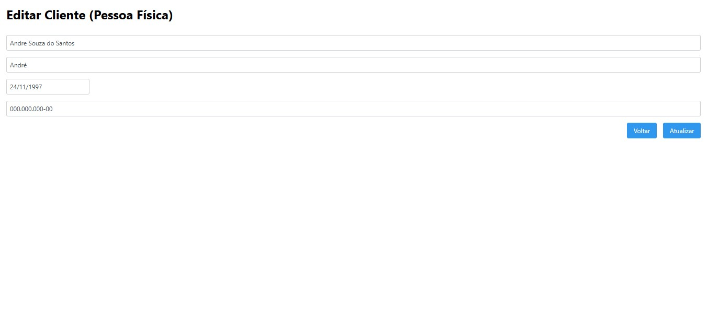

# Application

### Retriving Customer

### Create Customer

### Edit Customer

# Steps

1. Configure [Wildfly](./docs/configure-wildfly.md) with Postgres Module.
2. start infra with command `docker compose -f infra/compose.yml up -d`
3. Run project.

# Tools

-   Plugin [EditorConfig](https://editorconfig.org/) for eclipse
-   IDE [Eclipse JavaEE](https://www.eclipse.org/downloads/packages/release/2023-09/r/eclipse-ide-enterprise-java-and-web-developers)
-   Application Server [Wildfly 30.0.1](https://www.wildfly.org/downloads/)
